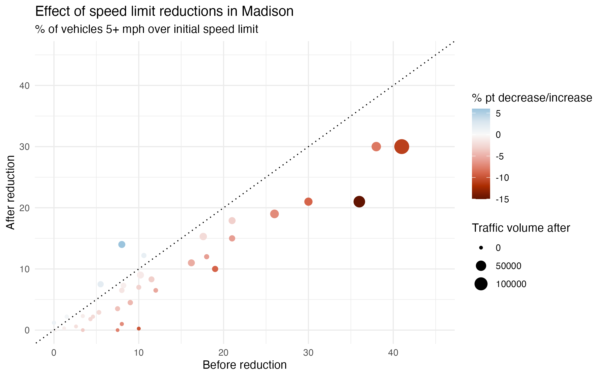

# speed_limit_reductions
The City of Madison reduced speed limits on many of its streets in the past few years. Many people questioned whether these reductions would lead to a reduction in speeds. In 2024, the City published speed data. This data was presented as a series of Excel graphs in a pdf: https://www.cityofmadison.com/transportation/documents/vision-zero/2020-2022%20Vision%20Zero_Progress%20Report%20APPENDIX%20A.pdf. I transferred the data to a spreadsheet manually, taking the numbers from looking at the charts. This may have resulted in some inaccuracies.

